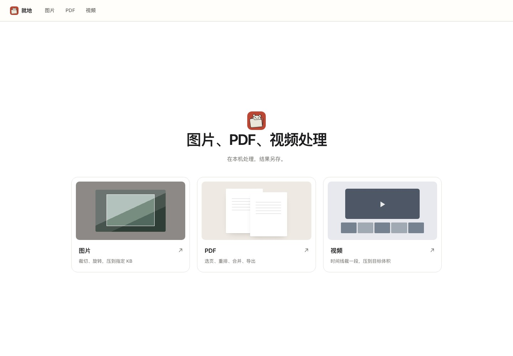
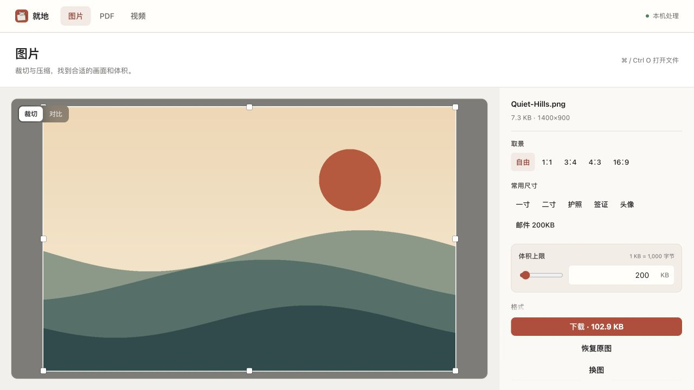
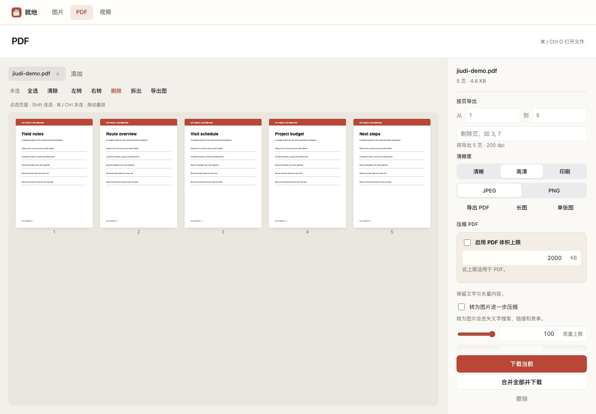

<div align="right"><a href="README.md">中文</a></div>


# Jiudi · 就地

**Smaller photos, organised PDFs, shorter videos.**

Jiudi is a file tool for Mac and Windows. Use it when a photo exceeds an upload limit, a PDF has pages you do not need, or you only want part of a video. Your files are processed on your computer and the results are saved as new files.



## Download

| Platform | Download |
|---|---|
| macOS 13+, Apple silicon / Intel | [Mac Universal](https://github.com/bocchitherock888-ux/jiudi/releases/download/v1.1.2/Jiudi-1.1.2-Mac-Universal.zip) |
| Windows 10/11, Intel / AMD | [Windows x64](https://github.com/bocchitherock888-ux/jiudi/releases/download/v1.1.2/Jiudi-1.1.2-Windows-x64.zip) |
| Windows 10/11, ARM64 | [Windows ARM64](https://github.com/bocchitherock888-ux/jiudi/releases/download/v1.1.2/Jiudi-1.1.2-Windows-ARM64.zip) |

[Release notes](https://github.com/bocchitherock888-ux/jiudi/releases/latest)

**Mac:** Unzip and open “就地.app”. **Windows:** Extract the archive and run `Jiudi.exe`. The interface opens in your browser; press Enter in the program window to quit.

The Mac app uses an ad-hoc signature and has not been notarised. Windows builds are unsigned. Your system may show a confirmation on first launch. Windows packages have passed cross-compilation and integrity checks; testing on Windows hardware is pending.

## Features

- **Images:** crop a photo, reduce it to a website’s upload limit, or process several images together.
- **PDFs:** remove or reorder pages, combine documents, or save pages as images.
- **Video:** trim clips and adjust resolution, audio, and target size.

Image and PDF tools work offline. Video tools download an encoder of about 32 MB on first use, then reuse the local cache. The app interface is in Chinese.

<table>
  <tr>
    <td width="50%"><a href="docs/images/image.jpg"></a></td>
    <td width="50%"><a href="docs/images/pdf.jpg"></a></td>
  </tr>
</table>

## Development

With Python 3.10+, run from the repository root:

```sh
python3 serve.py --open
```

See the [development guide](docs/DEVELOPMENT.md) for the project structure, Go runtime, and Mac build instructions.

## Licence and feedback

Created by **Tipram** (醉步羊).

Original code is licensed under [MIT](LICENSE). See the [third-party notices](Licenses/THIRD-PARTY-NOTICES.md) for bundled components and FFmpeg licensing.

[Report an issue](https://github.com/bocchitherock888-ux/jiudi/issues/new) with your OS version and steps to reproduce it.
